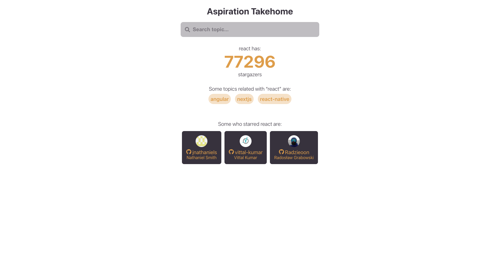

# Takehome App



Check [live demo](https://monumental-creponne-78ba6d.netlify.app).

## Setup

Create a `.env` file at the root of the project with the folling variables:

```env
REACT_API_URL=https://api.github.com/graphql
REACT_INITIAL_SEARCH_VALUE=react
REACT_GITHUB_TOKEN=<YOUR GITHUB TOKEN>
```

## Run project

Run the `npm start` script and open [http://localhost:3000](http://localhost:3000) to view the app in the browser.
